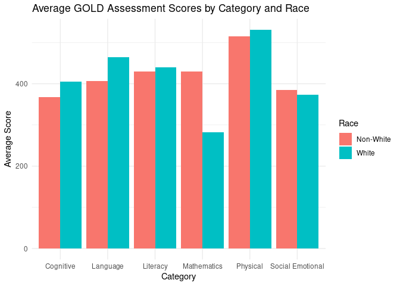

Project proposal
================
Team RARE

``` r
library(tidyverse)
library(broom)
library(readxl)
install.packages("ggridges")
library(ggridges)
#GOLD assessment results for all EHS students
EHS_all_students <- read_excel("../data/ignore/Promise Early Education 2024-2025 Data- CLEAN.xlsx", 
    sheet = "EHS (birth-3)")

#GOLD assessment results for white vs. non-white EHS students
EHS_with_race <- read_excel("../data/ignore/Promise Early Education 2024-2025 Data- CLEAN.xlsx", 
    sheet = "EHS Race")

#GOLD assessment results for DLL vs non-DLL EHS students
EHS_Dual_Language <- read_excel("../data/ignore/Promise Early Education 2024-2025 Data- CLEAN.xlsx", 
    sheet = "EHS Eng SE")

#GOLD assessment results for multi-year vs first-year participating EHS students
EHS_multi_year <- read_excel("../data/ignore/Promise Early Education 2024-2025 Data- CLEAN.xlsx", 
    sheet = "EHS MY-NMY")
```

## 1. Introduction

Promise Early Education is a program designated for low-income or
vulnerable families in the Lewiston-Auburn area. They provide education
to income-eligible children who receive social services, such as the
SNAP program, from the government. Along with educating children, they
provide services to students with mental health and learning
disabilities. Additionally, Promise also provides health and nutritional
support for children.

To assess the students, Promise uses the GOLD assessment system. The
GOLD system tracks students’ development over time in specific areas
such as social-emotional, physical, cognitive, and language abilities.
It tracks students on a widely held expectation (WHE) score to determine
if they are below, meeting, or exceeding developmental expectations. The
data collected is specifically targeted for students aged 0-5, and
includes raw scores, scaled scores, and national norm comparison. This
data is then utilized in the classroom to help teachers create lesson
plans and give individualized attention, all to support the children’s
development.

For this project, our research question will explore children’s
development progress in the Promise Early Education program. We will
analyze and evaluate the developmental gains of three key populations:
Dual Language Learners (DLLs), students receiving special education
services (those with an Individualized Education Program, or IEP),
multi-year participants, and students of different racial/ethnic
backgrounds. By comparing the progress of these subgroups against their
peers, this research aims to illuminate how different student
populations are supported in the classroom. Some questions we hope to
investigate are:

1.  How does the progress of dual language learners differ from their
    peers?

2.  What are the weakest/strongest skill sets of dual language learners
    compared to standard expectations (categorized by physical,
    social-emotional, literacy, etc.)

3.  How does the progress across a year differ for a multi-year student
    compared to a first time student?

4.  How does the proficiency in various categories differ by age range
    (B-1, 1-2, 2-3)?

5.  How does growth for students compare by different seasons (fall to
    winter, winter to spring)?

6.  Are there differences in progress between students of different
    races?

## 2. Data

Because of the complex structure of the original dataset, we chose to
clean and organize the data in Google Sheets rather than R to simplify
the reformatting process. Specifically, we created new columns
indicating “yes” or “no” for Dual Language Learners, race, and
multi-year students. We also cleaned by consolidating data from all
Early Head Start (EHS) programs into unified columns, because the
original dataset had some categories arranged in columns and others in
rows.

- `Category` = `which aspect is being tested`
- `WHE Bottom` = `Bottom widely held expectation scores`
- `WHE Top` = `Top widely held expectation scores`
- `Average` = `Average scores`
- `# Children` = `Number of children being tested`
- `# Below` = `Number of students below average`
- `% Below` = `Percent of students below average`
- `# Meeting` = `Number of students meeting expectations`
- `% Meeting` = `Percentage of students meeting expectations`
- `# exceeding` = `Number of students exceeding expectations`
- `% exceeding` = `The percentage of students exceeding expectations`
- `Time period` = `Fall, winter, or spring trimesters`
- `Age range` = `The age range of the students`
- `White` = `If the student is white or not`
- `Dual Language` = `If the student is a dual language learner or not`
- `Multi-Year` = `If the student is a Multi-Year student or not`

``` r
#GOLD assessment results for all EHS students
dim(EHS_all_students)
```

    ## [1] 45 13

``` r
glimpse(EHS_all_students)
```

    ## Rows: 45
    ## Columns: 13
    ## $ Category      <chr> "Social-Emotional", "Social-Emotional", "Social-Emotiona…
    ## $ `WHE Bottom`  <dbl> 110, 240, 318, 110, 240, 318, 110, 240, 318, 141, 320, 4…
    ## $ `WHE Top`     <dbl> 258, 354, 403, 258, 354, 403, 258, 354, 403, 320, 428, 5…
    ## $ `# Children`  <dbl> 6, 8, 20, 6, 8, 20, 6, 8, 20, 6, 8, 20, 6, 8, 20, 6, 8, …
    ## $ Average       <dbl> 169, 268, 352, 211, 347, 375, 273, 356, 386, 231, 381, 4…
    ## $ `# Below`     <dbl> NA, 2, 3, NA, NA, 1, NA, NA, 1, NA, 1, 1, NA, NA, NA, NA…
    ## $ `% Below`     <dbl> NA, 25.0, 15.0, NA, NA, 5.0, NA, NA, 5.0, NA, 12.5, 5.0,…
    ## $ `# Meeting`   <dbl> 6, 6, 17, 5, 5, 18, 3, 3, 14, 6, 6, 18, 4, 5, 15, 1, 1, …
    ## $ `% Meeting`   <dbl> 100.0, 75.0, 85.0, 83.3, 62.5, 90.0, 50.0, 37.5, 70.0, 1…
    ## $ `# exceeding` <dbl> NA, NA, NA, 1, 3, 1, 3, 5, 5, NA, 1, 1, 2, 3, 5, 5, 7, 8…
    ## $ `% exceeding` <dbl> NA, NA, NA, 16.7, 37.5, 5.0, 50.0, 62.5, 25.0, NA, 12.5,…
    ## $ `Time Period` <chr> "Fall 2024/2025", "Fall 2024/2025", "Fall 2024/2025", "W…
    ## $ `age range`   <chr> "B-1", "1-2", "2-3", "B-1", "1-2", "2-3", "B-1", "1-2", …

``` r
#GOLD assessment results for white vs. non-white EHS students
dim(EHS_with_race)
```

    ## [1] 108  14

``` r
glimpse(EHS_with_race)
```

    ## Rows: 108
    ## Columns: 14
    ## $ Category            <chr> "Social Emotional", "Social Emotional", "Social Em…
    ## $ `WHE Bottom`        <dbl> 110, 240, 318, 110, 240, 318, 110, 240, 318, 110, …
    ## $ `WHE Top`           <dbl> 258, 354, 403, 258, 354, 403, 258, 354, 403, 258, …
    ## $ `# Children`        <dbl> 4, 5, 14, 1, 3, 2, 4, 5, 14, 1, 3, 2, 4, 5, 14, 1,…
    ## $ Average             <dbl> 175, 319, 348, 208, 183, 365, 211, 350, 376, 258, …
    ## $ `# Below`           <dbl> NA, NA, 3, NA, 2, NA, NA, NA, 1, NA, NA, NA, NA, N…
    ## $ `% Below`           <dbl> NA, NA, 21.4, NA, 66.7, NA, NA, NA, 7.1, NA, NA, N…
    ## $ `# Meeting`         <dbl> 4, 5, 11, 1, 1, 2, 3, 3, 12, 1, 2, 2, 2, 2, 10, NA…
    ## $ `% Meeting`         <dbl> 100.0, 100.0, 78.6, 100.0, 33.3, 100.0, 75.0, 60.0…
    ## $ `# exceeding`       <dbl> NA, NA, NA, NA, NA, NA, 1, 2, 1, NA, 1, NA, 2, 3, …
    ## $ `% exceeding`       <dbl> NA, NA, NA, NA, NA, NA, 25.0, 40.0, 7.1, NA, 33.3,…
    ## $ `Time Period`       <chr> "Fall 2024/2025", "Fall 2024/2025", "Fall 2024/202…
    ## $ `White (Yes or No)` <chr> "No", "No", "No", "Yes", "Yes", "Yes", "No", "No",…
    ## $ `Age Range`         <chr> "B-1", "1-2", "2-3", "B-1", "1-2", "2-3", "B-1", "…

``` r
#GOLD assessment results for DLL vs non-DLL EHS students
dim(EHS_Dual_Language)
```

    ## [1] 108  14

``` r
glimpse(EHS_Dual_Language)
```

    ## Rows: 108
    ## Columns: 14
    ## $ Category       <chr> "Social Emotional", "Social Emotional", "Social Emotion…
    ## $ `WHE Bottom`   <dbl> 110, 240, 318, 110, 240, 318, 110, 240, 318, 110, 240, …
    ## $ `WHE Top`      <dbl> 258, 354, 403, 258, 354, 403, 258, 354, 403, 258, 354, …
    ## $ `# Children`   <dbl> 4, 5, 14, 4, 5, 14, 4, 5, 14, 2, 3, 6, 2, 3, 6, 2, 3, 6…
    ## $ Average        <dbl> 170, 244, 355, 210, 361, 377, 265, 367, 388, 168, 308, …
    ## $ `# Below`      <dbl> NA, 2, 1, NA, NA, 1, NA, NA, 1, NA, NA, 2, NA, NA, NA, …
    ## $ `% Below`      <dbl> NA, 40.0, 7.1, NA, NA, 7.1, NA, NA, 7.1, NA, NA, 33.3, …
    ## $ `# Meeting`    <dbl> 4, 3, 13, 4, 2, 12, 2, 1, 9, 2, 3, 4, 1, 3, 6, 1, 2, 5,…
    ## $ `% Meeting`    <dbl> 100.0, 60.0, 92.9, 100.0, 40.0, 85.7, 50.0, 20.0, 64.3,…
    ## $ `# exceeding`  <dbl> NA, NA, NA, NA, 3, 1, 2, 4, 4, NA, NA, NA, 1, NA, NA, 1…
    ## $ `% exceeding`  <dbl> NA, NA, NA, NA, 60.0, 7.1, 50.0, 80.0, 28.6, NA, NA, NA…
    ## $ `Time Period`  <chr> "Fall 2024/2025", "Fall 2024/2025", "Fall 2024/2025", "…
    ## $ `Age Range`    <chr> "B-1", "1-2", "2-3", "B-1", "1-2", "2-3", "B-1", "1-2",…
    ## $ `Dual Langage` <chr> "No", "No", "No", "No", "No", "No", "No", "No", "No", "…

``` r
#GOLD assessment results for multi-year vs first-year participating EHS students
dim(EHS_multi_year)
```

    ## [1] 72 14

``` r
glimpse(EHS_multi_year)
```

    ## Rows: 72
    ## Columns: 14
    ## $ Category      <chr> "Social-Emotional", "Social-Emotional", "Social-Emotiona…
    ## $ `WHE Bottom`  <dbl> 240, 318, 240, 318, 240, 318, 240, 318, 240, 318, 240, 3…
    ## $ `WHE Top`     <dbl> 354, 403, 354, 403, 354, 403, 354, 403, 354, 403, 354, 4…
    ## $ `# Children`  <dbl> 3, 14, 5, 5, 3, 14, 5, 5, 3, 14, 5, 5, 3, 14, 5, 5, 3, 1…
    ## $ Average       <dbl> 323, 361, 235, 328, 339, 376, 353, 371, 348, 382, 360, 3…
    ## $ `# Below`     <dbl> NA, 1, 2, 2, NA, NA, NA, 1, NA, NA, NA, 1, NA, 1, 1, NA,…
    ## $ `% Below`     <dbl> NA, 7.1, 40.0, 40.0, NA, NA, NA, 20.0, NA, NA, NA, 20.0,…
    ## $ `# Meeting`   <dbl> 3, 13, 3, 3, 2, 14, 3, 3, 1, 11, 2, 2, 3, 12, 3, 5, 2, 1…
    ## $ `% Meeting`   <dbl> 100.0, 92.9, 60.0, 60.0, 66.7, 100.0, 60.0, 60.0, 33.3, …
    ## $ `# exceeding` <dbl> NA, NA, NA, NA, 1, NA, 2, 1, 2, 3, 3, 2, NA, 1, 1, NA, 1…
    ## $ `% exceeding` <dbl> NA, NA, NA, NA, 0.333, NA, 40.000, 20.000, 66.700, 21.40…
    ## $ `Time Period` <chr> "Fall 2024/2025", "Fall 2024/2025", "Fall 2024/2025", "F…
    ## $ `Age Range`   <chr> "1-2", "2-3", "1-2", "2-3", "1-2", "2-3", "1-2", "2-3", …
    ## $ `Multi-Year`  <chr> "yes", "yes", "no", "no", "yes", "yes", "no", "no", "yes…

## 3. Data analysis plan

The variables we will be visualizing to explore the research questions
include:

`Dual Language`

`category`

`Average`

`Multi-year`

X (TBD- waiting for IEP data)

`Time period`

`White`

Types of graphs we may want to use:

- Line plot : to show the distribution of scores deviating away from the
  average for each `category`
- Waffle plots : To compare multi-year and not multi-year students
- Box Plot : showing the range of average scores
- Bar Graph : to compare students meeting, exceeding, and below
  expectations
- Bar Graph : to compare differences among distinctions like race and
  language

``` r
EHS_with_race |>
  mutate(Race_Group = if_else(`White (Yes or No)` == "Yes", "White", "Non-White")) |>
  group_by(Category, Race_Group) |>
  summarise(
    Weighted_Average = sum(Average * `# Children`) / sum(`# Children`),
    Total_Children = sum(`# Children`)
  ) |>
  ggplot(aes(x = Category, y = Weighted_Average, fill = Race_Group)) +
  geom_col(position = position_dodge()) +
  geom_text(
    aes(label = paste0("n=", Total_Children)),
    position = position_dodge(width = 0.9),
    vjust = -0.2
  ) +
  labs(
    title = "Weighted Average GOLD Assessment Scores by Category and Race",
    subtitle = "Counts (n) represent the total number of children contributing to each weighted average.",
    x = "Category",
    y = "Weighted Average Score",
    fill = "Race"
  ) +
  theme(axis.text.x = element_text(angle = 45, hjust = 1))
```

    ## `summarise()` has grouped output by 'Category'. You can override using the
    ## `.groups` argument.

<!-- -->

Our first preliminary exploratory data analysis is a bar graph comparing
GOLD assessment scores between races using a weighted average. This
visualization shows that generally, scores are similar between races,
except for non-white students scoring significantly better in
mathematics. Exploring this graph is useful as it showed us the
importance of a weighted averages in our dataset. When we have different
number of students, the average value of the score will turn out
differently. It also shows us what visualizations work and don’t work
with data regarding race, for example, a ridge plot would not be able to
show this data because we don’t have enough average data points.
